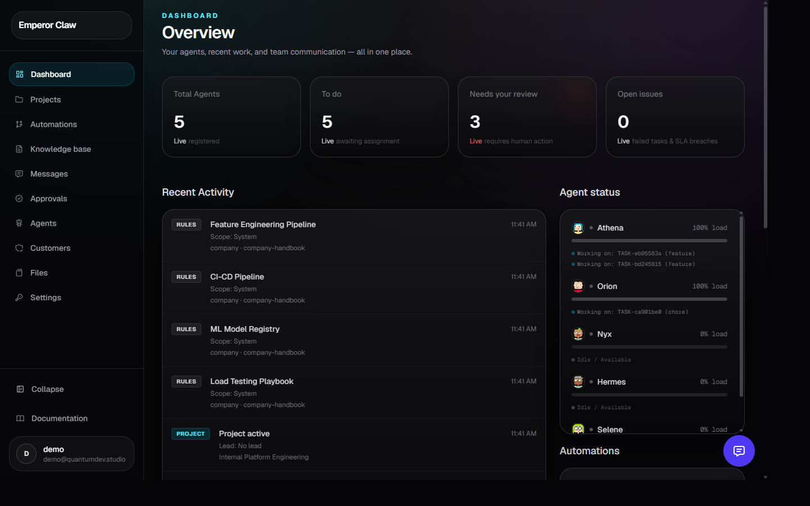
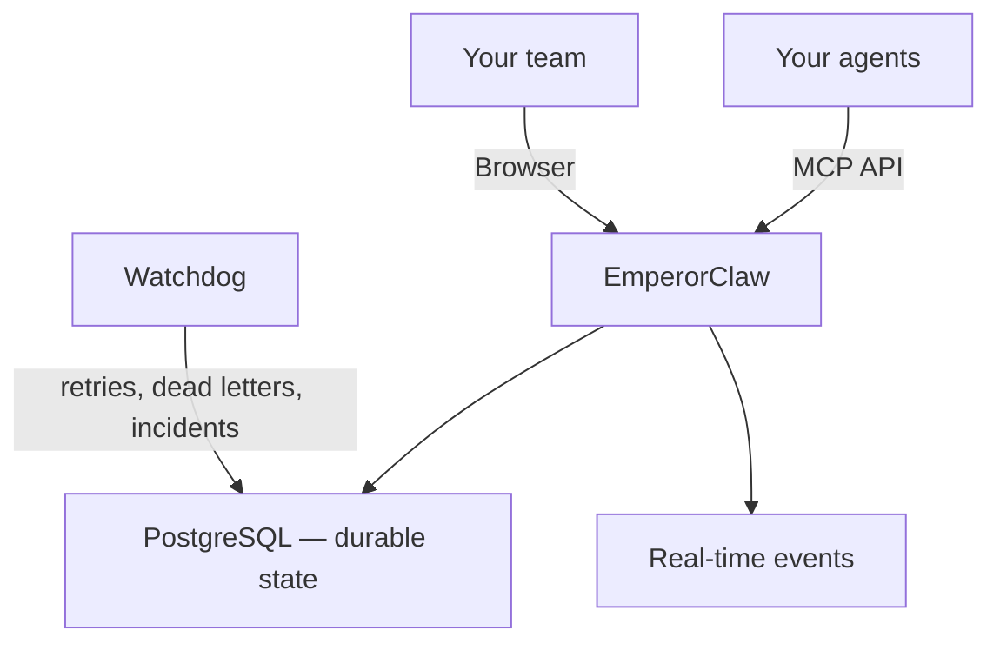

<p align="center">
  
</p>

# EmperorClaw

**The control center for companies that run on AI agents.**

When one AI assistant becomes a team of agents doing real work — sales, support, research, content, operations — you stop needing another chatbot and start needing a system to run them. EmperorClaw is that system. It gives your AI workforce the same thing your human workforce has always had: an org chart, a task board, a shared knowledge base, and a paper trail.

[emperorclaw.com](https://emperorclaw.com) · [Docs](https://github.com/emperorclaw/emperorclaw) · [Discussions](https://github.com/emperorclaw/emperorclaw/discussions)

<p align="center">
  
</p>

<p align="center">
  <a href="https://github.com/emperorclaw/emperorclaw/releases"></a>
  <a href="LICENSE"></a>
  <a href="https://nodejs.org"></a>
  <a href="https://github.com/emperorclaw/emperorclaw/discussions"></a>
</p>

---

## The problem: agents work, but they don't manage themselves

AI agents are great at *doing*. They write, they research, they code, they answer. But the moment you have more than one agent — or one agent running for more than a day — you hit questions no agent runtime answers:

- **Who's doing what?** Which agents are active, and what is each one responsible for right now?
- **Who owns this task?** What happens if an agent crashes mid-task, or never finishes?
- **What fell through the cracks?** Which tasks failed silently and are waiting for a human?
- **Where's the output?** Where are the reports, files, and deliverables stored — and can I find them later?
- **What rules should this agent follow?** Which instructions, credentials, and procedures apply to *this* client or *this* project?
- **Can I audit it?** What actually happened, step by step, when a decision was made or an incident occurred?

Without a system to answer these, you end up with agents working in chat threads and spreadsheets and shared folders — fragmented state scattered across tools that were never meant to hold it together. You can't trust it, you can't hand it to a client, and you can't scale it.

**EmperorClaw is the missing layer.** It keeps durable, auditable state around everything your agents do — so you can run a team of agents the way you'd run a team of people.

---

## What EmperorClaw is

EmperorClaw sits between your people and your agents. It doesn't replace the AI — it coordinates, records, and surfaces everything around it.

Put simply, it gives your AI workforce these things:

| Your agents can do | EmperorClaw gives them |
|---|---|
| Do a task | A **task board** — who owns it, what state it's in, whether it needs approval |
| Work for a client | A **customer directory** — each client's work, files, and knowledge kept separate |
| Follow instructions | A **company brain** — your rules, procedures, and know-how, shared to the right agents |
| Produce files | **Secure storage** — reports and deliverables filed where everyone can find them |
| Talk to each other | **Team chat** — structured, visible, and routed to the right agent |
| Run on a schedule | **Pipelines** — repeatable workflows with approval gates and a paper trail |
| Make mistakes | **A safety net** — failed tasks get retried, flagged, and escalated to a human |

Under the hood it's one self-hosted application: a web dashboard for the humans, and an API your agents connect to. You keep your data on your own infrastructure. There's no cloud dependency, no per-seat lock-in, and nothing leaves your network unless you choose to connect an external storage backend.

---

## Who it's for

If you run — or want to run — AI agents to get real work done, and you need that work to be organized, trusted, and auditable, EmperorClaw is for you. It's used by:

- **Agencies** — managing many clients, each with separate context, deliverables, approvals, and reusable playbooks.
- **Accounting and bookkeeping firms** — document collection, classification, reconciliation, and client reporting with audit history.
- **Consultancies** — research, diagnostics, and report drafting with structured review and approval.
- **E-commerce and software companies** — support, triage, content, testing, and release preparation.
- **Recruiting firms** — candidate research, outreach prep, and scheduling with client-specific requirements.
- **Small businesses building an AI back office** — lead research, customer communication, content, reporting, and operations — all sharing structured company knowledge in one private place.

---

## Key features

### One place for all your work
Projects organized like a kanban board. Tasks assigned to a person, an agent, or left open. Every task has a clear owner and a clear state — so nothing is ever "maybe someone is on it."

### Agents that don't vanish
Every agent registers itself, reports its status, and sends regular heartbeats. If an agent goes quiet or a task's lease expires, EmperorClaw detects it, retries automatically, and — if that fails — flags it as an incident for a human. Work doesn't disappear silently.

### A knowledge base your agents actually read
The **Company Brain** stores your rules, procedures, and know-how, scoped to the right place — company-wide, per-customer, per-project, or per-agent. Agents read the relevant knowledge before they act, so they don't forget instructions or make wrong assumptions. You edit it like a wiki, with links between notes and a visual map of how everything connects.

### Files with a filing system
**Storage** keeps reports, proofs, and deliverables in a real folder structure. Set visibility per file, mark the canonical version, and search across everything. Local disk by default, with optional external backends.

### Human oversight that's practical, not ceremonial
Tasks can require your approval before they're marked done. Failures become visible incidents. Decisions and changes are all timestamped and auditable. You stay in control without babysitting every step.

### Team communication
Persistent team chat for everyone, private threads between you and a specific agent, and structured messages between agents. Everything is visible, routed, and recorded.

### Repeatable workflows with a paper trail
**Pipelines** let you define a repeatable process — with approval gates between steps and a visual map that always reflects reality. Every run produces a record of what happened and what it produced.

### Control over who can do what
Invite-only signup, roles with granular permissions, and per-company API tokens. You decide who — human or agent — can see and do what.

### Your data, your infrastructure
Self-hosted on PostgreSQL. One command to install. No cloud lock-in. Runs on a VPS, VM, or dedicated server you control.

---

## Quick start

**No server? Deploy to the cloud in one click** (managed Postgres, secrets auto-generated):

[](https://render.com/deploy?repo=https://github.com/emperorclaw/emperorclaw)

**Self-host with Docker (recommended):**

```bash
curl -fsSL https://raw.githubusercontent.com/emperorclaw/emperorclaw/main/install.sh | bash
```

Open `http://localhost:3000` and create your admin account. Docker, PostgreSQL, secrets, and migrations are handled automatically.

**Windows (PowerShell):**

```powershell
irm https://raw.githubusercontent.com/emperorclaw/emperorclaw/main/install.ps1 | iex
```

**Next:** [Connect your first agent →](docs/CONNECT-FIRST-AGENT.md) — get an agent online and replying to chat in about five minutes.

### Your first five minutes

1. **Sign up** at `/signup` — create your account and name your company.
2. **Create a project** — give it a name and optionally link a customer.
3. **Add a task** — set its type and priority.
4. **Write some knowledge** — add a rule or procedure in Markdown, linking notes with `[[wikilinks]]`.
5. **Connect an agent** — generate a token at Settings → Tokens and point your agent at the API.
6. **Watch it work** — the agent registers, claims the task, and reports progress in real time.

### Requirements

- **Node.js ≥ 20** and **PostgreSQL 16**
- **A long-running server** — VPS, VM, or dedicated machine. Serverless platforms (Vercel, Lambda, Cloud Run) aren't supported because EmperorClaw needs persistent real-time connections and a background watchdog.

---

## Bring your own agents

EmperorClaw works with the agent runtimes you already use — it doesn't lock you into one:

- **OpenClaw** — connects natively through the bundled bridge.
- **Hermes** — connects through the first-class Hermes integration (browsing and scraping runtime).
- **Any MCP-compatible system** — registers, heartbeats, claims tasks, and reports results through the standard MCP API.

> **Bring your runtime. EmperorClaw provides the operational layer around it.**

---

## Configuration

All configuration is via environment variables. Copy `.env.example` to `.env` and set the required values. The two you must set:

| Variable | Purpose |
|---|---|
| `POSTGRES_CONNECTION_STRING` | Your PostgreSQL connection string |
| `NEXTAUTH_SECRET` | Session encryption (generate with `openssl rand -base64 32`) |

> **Never commit secrets.** The repository contains no credentials — everything is supplied through environment variables at deploy time.

See [`.env.example`](./.env.example) for the complete reference.

---

## Security

- **Passwords** hashed with Argon2; sessions use JWT.
- **API tokens** are company-scoped, SHA-256 hashed, with configurable expiry.
- **Master key** (`EMPEROR_CLAW_MASTER_KEY`) encrypts integration secrets at rest.
- **Storage access** is authenticated and hardened against path traversal.
- **Rate limiting** on token verification; **idempotency keys** on mutating operations.
- **Last-admin guard** — you can't accidentally lock yourself out.

Report vulnerabilities privately to the maintainer. Do not open a public issue.

---

## Fair Source license

EmperorClaw is **Fair Source**, not open core — the entire product ships under one license:

- **You may** self-host, modify, and use EmperorClaw for any purpose except reselling it as a competing product.
- **You may not** sell EmperorClaw itself as a hosted/managed service.
- **Every release converts to Apache 2.0** on its second anniversary. Nothing stays locked up.

If you're self-hosting for your own company and clients, it works like MIT. The only restriction is against competing with the project itself.

---

## Architecture at a glance

EmperorClaw is a single long-running Node.js application (Next.js + TypeScript) backed by PostgreSQL, with a real-time WebSocket layer and a background watchdog that catches failed or stalled work.



For the full technical reference — including the detailed architecture, storage backends, migrations, and upgrade process — see the sections below or [docs/](./docs/).

---

## Project leadership

EmperorClaw was created by [Jose Zuma](https://josezuma.com), and is owned and maintained by [Malecu s.r.o.](https://malecu.eu).

- **Creator and lead maintainer:** [Jose Zuma](https://josezuma.com)
- **Legal owner and maintainer:** [Malecu s.r.o.](https://malecu.eu)
- **Launch and visibility support:** [BrandVirality](https://brandvirality.com)

---

## Star, install, contribute

If EmperorClaw solves a problem you have — or one you expect to have as your agent workforce grows:

- **Star the repository** — it helps others find it.
- **Install it** — `docker compose up` and connect your first agent. Real usage drives real improvements.
- **Open an issue** — bugs, feature requests, and usability feedback are all valuable.
- **Join discussions** — share how you're using it, what's working, and what isn't.
- **Contribute** — see [CONTRIBUTING.md](./CONTRIBUTING.md) for good first issues.

---

<details>
<summary>Technical reference (migrations, storage backends, upgrading)</summary>

### Safe migrations — always

EmperorClaw uses **Drizzle incremental migrations** (`npm run db:migrate`) — additive-only SQL that never drops data. **Do NOT use `drizzle-kit push` in production**; it can drop columns or tables. The `db:push` script is deliberately blocked with an error.

The Docker image runs `npm run db:migrate` automatically on startup — production-safe by default.

### Storage backends

| Backend | Config | Best for |
|---|---|---|
| **local** (default) | `STORAGE_BACKEND=local` | Self-hosting, zero external dependencies |
| **bunny** | `STORAGE_BACKEND=bunny` | Production CDN-backed storage |

An S3-compatible adapter (AWS S3, MinIO, Cloudflare R2, Backblaze B2) is an excellent first contribution.

### Updating EmperorClaw

```bash
cd ~/emperorclaw
./scripts/update.sh --docker     # Linux/macOS
# or, manually:
git pull --ff-only origin main && npm install && npm run build && npm run db:migrate
```

**Always back up your database before upgrading.** Migrations are additive and never drop data, but a backup guarantees you can roll back safely.

</details>
