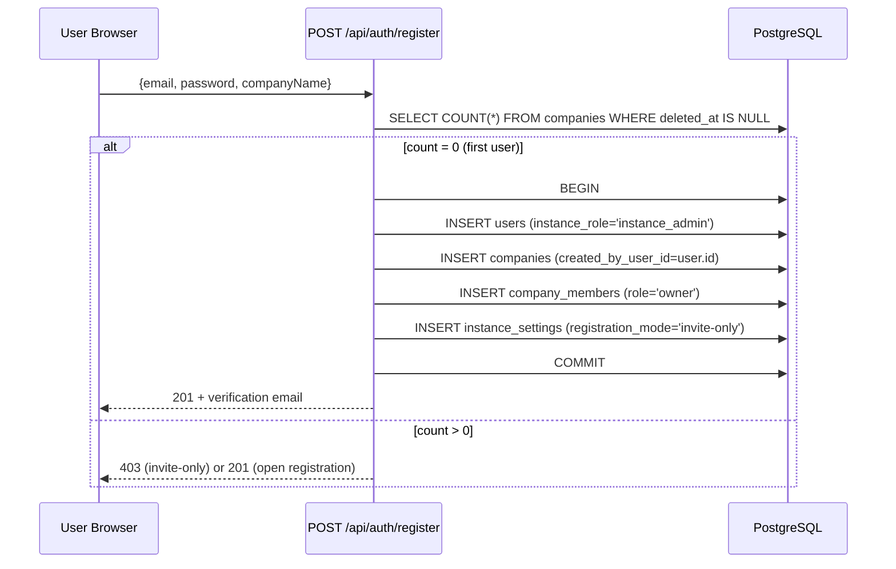
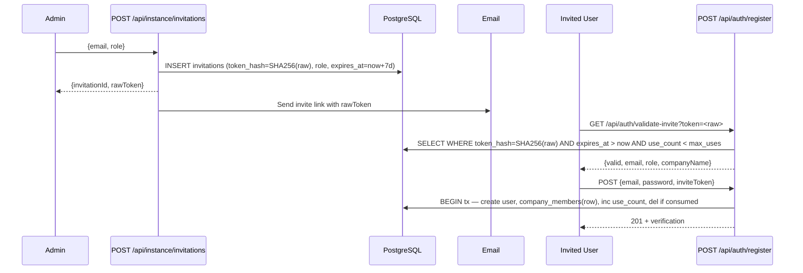

# Design: Team RBAC & Instance-Aware Multi-Tenancy

**Change:** `team-rbac`
**Date:** 2026-07-17

---

## 1. Module Architecture

| Module | Action | Responsibility |
|--------|--------|----------------|
| `src/lib/env.ts` | Modify | Add `DEPLOYMENT_MODE` export (`"self-hosted"` default) |
| `src/lib/instance.ts` | **New** | `isSelfHosted()` / `isCloud()`, `getInstanceCompany()` (cached ∞), `getInstanceSettings()` (cached 60s TTL), `setInstanceSetting()` (invalidates cache, instance_admin gated) |
| `src/lib/roles.ts` | **New** | `PERMISSIONS` matrix (Map), `hasPermission(user, perm, companyId?)`, `requireRole(...roles)` → guard, `getEffectiveRole(user, companyId?)` → resolves max of `instance_role` + `company_members.role` |
| `src/lib/invitations.ts` | **New** | `createInvitation({email, role, companyId, createdBy})`, `validateInviteToken(rawToken)` → `{valid, email, role, companyName} \| null`, `consumeInvite(rawToken, userId)` in tx |
| `src/lib/auth.ts` | Modify | `getCompanyId()`: if self-hosted → cached single-company lookup; JWT `callbacks.jwt` add `instanceRole` + `companyRole` claims |
| `src/middleware.ts` | Modify | Rewrite: `withAuth` preserved for base auth; new `withRole(...roles)` wrapper for API routes; self-hosted boot detection on `/signup` |

### New API Routes

| Route | Method | Auth | Min Role | Module |
|-------|--------|------|----------|--------|
| `/api/instance/invitations` | POST | ✅ | `admin` | `src/app/api/instance/invitations/route.ts` |
| `/api/instance/invitations` | GET | ✅ | `admin` | (same) |
| `/api/instance/invitations/[id]` | DELETE | ✅ | `admin` | `src/app/api/instance/invitations/[id]/route.ts` |
| `/api/instance/settings` | GET | ✅ | any | `src/app/api/instance/settings/route.ts` |
| `/api/instance/settings` | PUT | ✅ | `instance_admin` | (same) |
| `/api/auth/validate-invite` | GET | ❌ | — | `src/app/api/auth/validate-invite/route.ts` |
| `/api/auth/register` | POST | ❌ | — | Modify: add self-hosted branching |

### New UI Pages

| Page | Route | Min Role |
|------|-------|----------|
| Member Management | `/dashboard/members` | `admin` |
| Instance Settings | `/dashboard/settings` | `instance_admin` |

---

## 2. Data Flow Diagrams

### Self-Hosted Bootstrap



### Invitation Flow



### Role Resolution Per Request

```
Request → middleware.ts → withAuth() → JWT validated
  → src/lib/auth.ts: getCompanyId() → cached lookup (self-hosted) or membership query (cloud)
  → Route handler calls withRole('admin') → getEffectiveRole(user, companyId)
    → max(users.instance_role, company_members.role) per hierarchy
    → role >= required? pass : 403
```

---

## 3. Database Schema (Drizzle Column Definitions)

### New: `invitations`

```typescript
export const invitations = pgTable("invitations", {
    id: uuid("id").primaryKey().defaultRandom(),
    companyId: uuid("company_id").notNull()
        .references(() => companies.id, { onDelete: "cascade" }),
    createdByUserId: uuid("created_by_user_id").notNull()
        .references(() => users.id),
    email: text("email").notNull(),
    tokenHash: text("token_hash").notNull(),
    role: text("role").notNull(), // 'admin' | 'member' | 'viewer'
    maxUses: integer("max_uses").default(1).notNull(),
    useCount: integer("use_count").default(0).notNull(),
    expiresAt: timestamp("expires_at").notNull(),
    createdAt: timestamp("created_at").defaultNow().notNull(),
    deletedAt: timestamp("deleted_at"), // soft-delete for revoke
}, (table) => ({
    tokenHashIdx: uniqueIndex("invitations_token_hash_idx").on(table.tokenHash),
    emailCompanyIdx: index("invitations_email_company_idx")
        .on(table.email, table.companyId),
}));
```

### New: `instanceSettings`

```typescript
export const instanceSettings = pgTable("instance_settings", {
    key: text("key").primaryKey(),
    value: jsonb("value").notNull(),
    updatedAt: timestamp("updated_at").defaultNow().notNull(),
});
```

### Modified: `users`

```typescript
// Add column after emailVerifiedAt:
instanceRole: text("instance_role").notNull().default("member"),
// Values: 'instance_admin' | 'member'
```

### Modified: `companyMembers`

```typescript
// Change role column:
role: text("role").notNull().default("member"),
// Values expand from 'owner' to: 'owner' | 'admin' | 'member' | 'viewer'
// Default changes from 'owner' to 'member'
```

---

## 4. Middleware Design

The matcher is split into two tiers:

1. **`withAuth` (existing)**: Applies to all `/((app))` routes — preserves 100% backward compat. Redirects unauthenticated to `/login`. Does NOT check roles.

2. **`withRole` (new wrapper)**: Used inside API route handlers and server components. Pattern:

```typescript
// src/lib/roles.ts
export function requireRole(...roles: Role[]) {
    return async function guard() {
        const session = await getValidatedServerSession();
        if (!session) throw new AuthError("Unauthorized", 401);
        const companyId = await getCompanyId();
        const effective = await getEffectiveRole(session.user.id, companyId);
        if (!roles.some(r => roleGte(effective, r))) {
            throw new AuthError("Forbidden — insufficient role", 403);
        }
        return { userId: session.user.id, companyId, role: effective };
    };
}
```

Route handler usage:
```typescript
export async function POST(req: NextRequest) {
    const ctx = await requireRole("admin")(); // throws → 401/403
    // ... handler logic
}
```

Self-hosted gate: any API route that should be cloud-only checks `isSelfHosted()` first and returns `403 { error: "Cloud-only operation" }`.

---

## 5. Migration Plan

**File**: `src/db/migrations/0020_team-rbac.sql`

```sql
-- New tables (idempotent)
CREATE TABLE IF NOT EXISTS "invitations" (
    "id" uuid PRIMARY KEY DEFAULT gen_random_uuid(),
    "company_id" uuid NOT NULL REFERENCES "companies"("id") ON DELETE CASCADE,
    "created_by_user_id" uuid NOT NULL REFERENCES "users"("id"),
    "email" text NOT NULL,
    "token_hash" text NOT NULL,
    "role" text NOT NULL,
    "max_uses" integer DEFAULT 1 NOT NULL,
    "use_count" integer DEFAULT 0 NOT NULL,
    "expires_at" timestamp NOT NULL,
    "created_at" timestamp DEFAULT now() NOT NULL,
    "deleted_at" timestamp
);
CREATE UNIQUE INDEX IF NOT EXISTS "invitations_token_hash_idx" ON "invitations"("token_hash");

CREATE TABLE IF NOT EXISTS "instance_settings" (
    "key" text PRIMARY KEY,
    "value" jsonb NOT NULL,
    "updated_at" timestamp DEFAULT now() NOT NULL
);

-- Modify existing tables (idempotent)
ALTER TABLE "users" ADD COLUMN IF NOT EXISTS "instance_role" text DEFAULT 'member' NOT NULL;

-- Detect first user: user who created the sole non-deleted company → instance_admin
UPDATE "users"
SET "instance_role" = 'instance_admin'
WHERE "id" IN (
    SELECT "created_by_user_id" FROM "companies" WHERE "deleted_at" IS NULL
)
AND (SELECT COUNT(*) FROM "companies" WHERE "deleted_at" IS NULL) = 1;
```

**Rollback**: Reverse ALTER TABLE (drop columns), DROP TABLE for new tables. No data loss risk — only additive changes.

---

## 6. API Endpoint Designs

### POST /api/instance/invitations

- **Auth**: ✅, **Role**: `admin`+
- **Body**: `{ email: string, role: 'member' | 'admin' | 'viewer' }`
- **Response 201**: `{ id, email, role, expiresAt, inviteUrl }`
- **Errors**: 400 (invalid email/role), 403 (insufficient role), 429 (rate limit: 20/hr/admin)
- **Queries**: `INSERT invitations`, `SELECT companies WHERE id = companyId` (for email template)

### GET /api/auth/validate-invite?token=&lt;raw&gt;

- **Auth**: ❌ (public)
- **Response 200**: `{ valid: true, email, role, companyName }` or `{ valid: false, reason }`
- **Errors**: 410 (expired), 404 (not found/consumed)
- **Queries**: Hash raw token → `SELECT invitations JOIN companies WHERE token_hash = hash AND deleted_at IS NULL AND expires_at > now() AND use_count < max_uses`

### POST /api/auth/register (modified)

- **Auth**: ❌
- **Self-hosted after bootstrap**: requires `inviteToken` if `registration_mode = 'invite-only'`
- **Body**: `{ email, password, companyName?, inviteToken?, acceptBetaDisclaimer }`
  - `companyName` required ONLY for bootstrap (first user)
- **201**: `{ message, data: { email, companyId, companyName } }`
- **403**: "Contact your admin for an invite" (invite-only, no token)
- **Queries**: bootstrap: COUNT companies → tx(user+company+membership+settings); invited: validate token → tx(user+membership+invite consumption)

### GET/PUT /api/instance/settings

- **GET**: Auth ✅, any role → `SELECT * FROM instance_settings` → `{ settings: { [key]: value } }`
- **PUT**: Auth ✅, `instance_admin` → `{ settings: { [key]: value } }` → `UPSERT instance_settings` per key
- **Cache**: Settings cached in memory (Map), 60s TTL, invalidated on PUT

---

## 7. Testing Strategy

| Layer | What | Tool | Files |
|-------|------|------|-------|
| Unit — role resolution | `getEffectiveRole`, `hasPermission`, role hierarchy ordering | `node --test` | `tests/roles.test.cjs` |
| Unit — invitation validation | Token hashing, expiry, consumption logic | `node --test` | `tests/invitations.test.cjs` |
| Unit — instance.ts | `isSelfHosted`, cached company lookup, settings CRUD | `npx tsx --test` | `tests/instance.test.ts` |
| Unit — DEPLOYMENT_MODE | Default fallback, cloud opt-in parsing | `node --test` | `tests/env-deployment.test.cjs` |
| Integration — bootstrap | First-user signup → instance_admin + company created atomically | `npx tsx --test` | `tests/bootstrap-flow.test.ts` |
| Integration — invite accept | Token validate → register → membership created, token consumed | `npx tsx --test` | `tests/invite-accept.test.ts` |

**Strict TDD Mode**: Active (per `openspec/config.yaml`). Test command:

```
node --test tests/*.test.cjs && npx tsx --test tests/path-sanitizer.test.ts
```

All new test files follow existing patterns: CommonJS `.test.cjs` for `node:test` + `node:assert/strict`, TypeScript `.test.ts` for `tsx --test`. Tests MUST fail before implementation, then pass after.

### Architecture Decisions

| Decision | Choice | Rationale | Rejected |
|----------|--------|-----------|----------|
| Deployment gating | `DEPLOYMENT_MODE` env var | Single codebase, industry standard (Supabase, PostHog, Cal.com) | Separate branches (divergence), feature flags (runtime overhead) |
| Role storage | `instance_role` on `users` + `role` on `company_members` | Separates instance-level from company-level; forward-compat with multi-company cloud | Single `role` column (can't express instance-vs-company distinction) |
| Token storage | SHA-256 hash in DB, raw only in email | Only hashed token persisted; raw token lives only in URL/email transit | JWT (cannot revoke), raw storage (leak risk) |
| Instance company lookup | Cached ∞ (immutable after bootstrap) | Self-hosted company ID never changes; avoids DB query on every request | Query every time (waste), DB trigger (unnecessary complexity) |
| Middleware pattern | `withAuth` preserved, `withRole` as handler wrapper | Zero breakage to existing routes; role checks only where needed | Full middleware rewrite (risky, breaks existing MCP token auth) |
| Soft-delete invitations | `deleted_at` timestamp | Allows "revoke" without data loss; matches existing project pattern (`companies.deleted_at`) | Hard delete (loses audit trail) |
