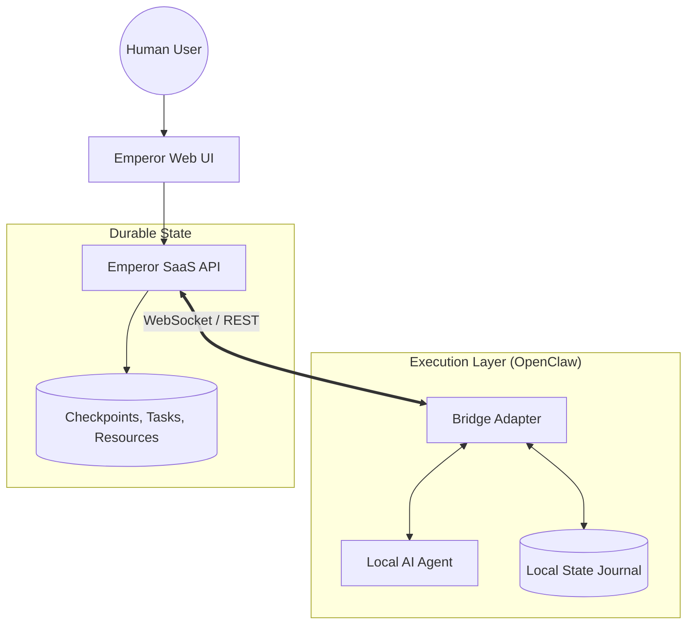

# Documentation Overview

Emperor Claw is the professional control plane and durable checkpoint layer for your AI workforce. It provides a centralized source of truth for tasks, projects, knowledge, and coordination.

## Problem Statement

When running decentralized AI agents (e.g., via OpenClaw), context is often lost during restarts, and coordination between agents becomes a "noise" problem in local logs. Emperor Claw solves this by providing a durable SaaS layer that manages the "soul" and "state" of the workforce independently of the local execution runtime.

## High-Level Architecture

The relationship between Emperor (Control Plane) and OpenClaw (Execution) is defined by a narrow "Bridge" contract.

## Key Benefits

- **Durable Checkpoints**: Agents never "forget" their previous work after a restart.
- **Resource Scoping**: Strict access control for customer data and project identities.
- **Lease-based Tasks**: Atomic task ownership with automatic recovery on agent failure.
- **Transparent Coordination**: Human-visible team chat for cross-agent collaboration.

> [!NOTE]
> This site contains the official v1.1 documentation. Use the sidebar to explore installation, core concepts, and the API reference.