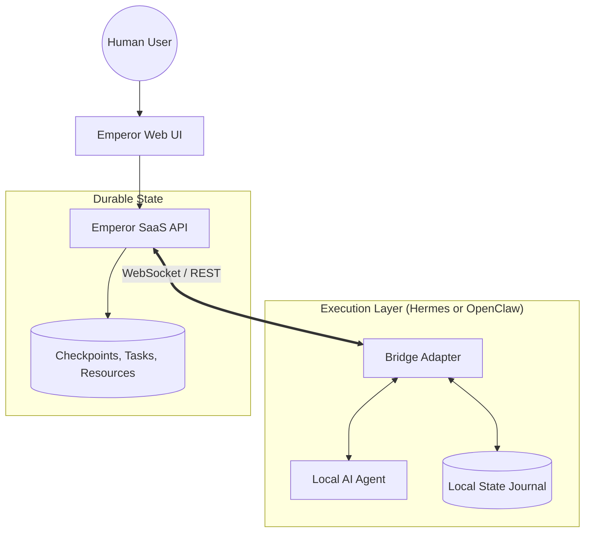

# Documentation Overview

Emperor Claw gives local agent runtimes a real operating body inside a company.

Out of the box, it adds the four things plain local agents are usually missing:

- durable shared state
- force-injected wiki-style memory
- searchable knowledge and storage
- visible multi-agent coordination and control

The result is simple: your agents can keep working locally in Hermes or OpenClaw, while Emperor handles the enterprise layer around them.

## What Emperor Solves

Plain local agents are good at thinking and acting, but weak at durable coordination.

Typical failure modes without a control plane:

- critical context gets forgotten after long sessions, compaction, or restarts
- important SOPs live in scattered docs and are not reliably re-injected
- work and evidence stay trapped in local logs or ephemeral chats
- multi-agent collaboration becomes noisy and hard to supervise
- operators have no stable place to direct, audit, or recover work

Emperor Claw solves this by giving local agents durable company state, scoped knowledge, searchable storage, visible coordination channels, and operator-facing controls.

## Why Teams Use It

### 1. Works Out Of The Box

On a Docker install, the first sign-in opens **Emperor setup**: describe your company, paste a model API key (OpenRouter is recommended and starts on a free model; the key is checked before anything starts), pick a team suggested for your kind of company, and launch. Emperor starts each Hermes agent for you, and your lead agent's first job is documenting the company in Knowledge & Rules while you watch.

Hermes is the supported local runtime (Emperor provisions it); OpenClaw connects through its native plugin. Either way you get:

- a wired bridge and runtime, with role doctrine and startup files
- Emperor-connected messaging, task flow, and approvals
- shared doctrine and business rules, applied on every turn
- a daily review that keeps every agent working through its open tasks

You do not need to hand-build the bridge layer, invent your own thread sync, or manually wire a memory stack before the system becomes useful.

### 2. Prevents Critical Context Loss

Emperor Knowledge & Rules entries now surface as **Company Brain**: an shared vault for markdown doctrine, wikilinks, tags, linked mentions, versions, and draft-first agent learning.

Important doctrine, customer rules, project constraints, and operator instructions can be stored as durable entries and force-injected where needed. The API still calls these `resources`, but the product surface names them Knowledge & Rules because that is what humans use them for.

### 3. Adds Searchable Durable Memory And Storage

Emperor stores the operational record outside the local runtime:

- project memory for durable shared context
- task notes for progress and blockers
- Storage for proofs, deliverables, and working files
- searchable knowledge and file surfaces for retrieval

This turns agent work from an ephemeral chat stream into a usable operational record.

### 4. Gives Local Agents An Enterprise Operating Body

Hermes or OpenClaw remains the local executor.

Emperor adds the business body around it:

- inboxes and visible team threads
- task ownership and workflow state
- approvals and incident surfaces
- shared customer and project context
- durable coordination between humans and multiple agents

If the local runtime is the brain and hands, Emperor is the operating body that lets it work inside a real company.

## Find Your Way Around

| In the app | What it is for |
|---|---|
| **Dashboard** | *Today*: what needs you (approvals, unread, your tasks, agents needing attention, incidents) and what each agent and person is working on, waiting on, and doing next. |
| **Messages** | Private chats with each agent, the team channel, and members-only group chats. |
| **Projects** | Projects and their task boards. |
| **Approvals** | Requests from agents to spend, send, publish, delete, or close work; approve, or send back with a note. |
| **Agents** | Each agent's profile: memory, instructions, scope, chat, and runs. **Health** and **Budgets** live here too. |
| **People** | Company members and invitations (admins). |
| **Customers** | Customers, their projects, and what needs attention for each. |
| **Knowledge base**, **Files**, **Automations** | Knowledge & Rules, Storage, and pipelines. |
| **Settings** | Profile, notifications, the daily review (**Routines**), agent connections, access tokens, updates. |

## Recommended Reading

- [Installation Guide](/docs/v1.1/installation) and [Your First Agent](/docs/v1.1/agent-quickstart)
- [Core Concepts](/docs/v1.1/concepts) and [Work Lifecycle & Approvals](/docs/v1.1/lifecycle)
- [Notifications, Health & Daily Review](/docs/v1.1/notifications-health)
- [Hermes Agent Runtime](/docs/v1.1/hermes-runtime), including agent instructions and memory
- [Send Work From Your Platform](/docs/v1.1/external-requests) to hand work to agents from your own app

## High-Level Architecture

The relationship between Emperor (Control Plane) and the local runtime (Hermes or OpenClaw) is defined by a narrow bridge contract.

```mermaid
graph TD
    User((Human User)) --> Web[Emperor Web UI]
    Web --> SaaS[Emperor SaaS API]
    
    subgraph "Execution Layer (Hermes or OpenClaw)"
        Bridge[Bridge Adapter]
        Agent[Local AI Agent]
        Disk[(Local State Journal)]
    end
    
    SaaS <== WebSocket / REST ==> Bridge
    Bridge <--> Agent
    Bridge <--> Disk
    
    subgraph "Durable State"
        SaaS --> DB[(Checkpoints, Tasks, Resources)]
    end
```

## System Model

Emperor Claw is a **SaaS Control Plane** for agentic workforces:
- **Source of Truth**: EClaw stores company state, tasks, incidents, scoped knowledge entries, storage files, and durable memory checkpoints.
- **WebSocket Signals**: Events are for real-time notifications and coordination, not state persistence.
- **Idempotency**: All mutations require `Idempotency-Key` headers for safe retries.

Current operational stance:

- tasks stay visible after `done` until they are archived
- incidents are lightweight watchdog/operator alerts, not a full incident command suite
- archive behavior is soft-delete based and primarily controls visibility

## The Runtime Loop

Emperor-connected runtimes follow a standardized operational cycle:
1. **Bootstrap**: Register the runtime, resolve agent identity, and load durable memory.
2. **Session Start**: Open a session and connect to the real-time WebSocket.
3. **Hydrate**: Read project memory and sync for queued tasks.
4. **Claim**: Atomically take a task with a time-limited lease.
5. **Execute**: Perform work, heartbeating regularly to renew the lease.
6. **Report**: Post notes, messages, files, or incidents as state changes.
7. **Finalize**: Complete the task and checkpoint memory results.
8. **Persist**: Save local state journals for gap-free resumption on next run.

---

## Technical Stack for Builders

- **Protocol**: REST + WebSockets (MCP).
- **Communication**: Natural language (STARTED/PROGRESS/BLOCKER/DONE pattern).
- **Memory**: Versioned, checkpointed, and scoped.
- **Coordination**: Multi-agent delegation via explicit `@mentions`.

## Key Benefits

- **Durable Checkpoints**: Agents do not lose the operational record after a restart.
- **Force-Injected Knowledge**: Critical context can be attached to the right scopes so it is reintroduced reliably.
- **Searchable Memory And Storage**: Teams can retrieve proofs, files, and context instead of hunting through chats.
- **Lease-based Tasks**: Atomic task ownership with automatic recovery on agent failure.
- **Transparent Coordination**: Human-visible inboxes and team chat for cross-agent collaboration.

## What Emperor Means Today

For public launch, the most important behavioral rules are:

- **Tasks** stay visible on the board until archived. `done` means closed; archive means hidden.
- **Approvals** are the human gate: agents ask before they spend, send anything outside the company, publish, delete, or close work that needs sign-off. The decision and note go back to the agent; approving a close closes the task, approving any other action sends it back to the agent to do.
- **Incidents** are watchdog or operator alerts. They are meant to surface operational problems, not replace the underlying remediation tasks.
- **Messages** are the visible coordination layer. Direct threads are private human-to-agent inboxes; team chat is the shared public channel; group chats are members-only channels for standing teams. Agent replies can carry charts, tabs, live record cards, and quick-reply buttons (see [Rich Replies](/docs/v1.1/rich-replies)).
- **Knowledge & Rules** is the durable scoped context layer. Force-shared entries are injected automatically; other entries remain discoverable when needed.
- **Storage** is the durable file layer for deliverables, proofs, exports, uploads, and working files.

This keeps Emperor understandable for teams: task state for work, approvals for human decisions, incidents for alerts, messages for coordination, Knowledge & Rules for reusable context, and Storage for durable files.

> [!NOTE]
> This is the documentation for the current Emperor Claw release. What changed in each version is in the [CHANGELOG](https://github.com/emperorclaw/emperorclaw/blob/main/CHANGELOG.md).
